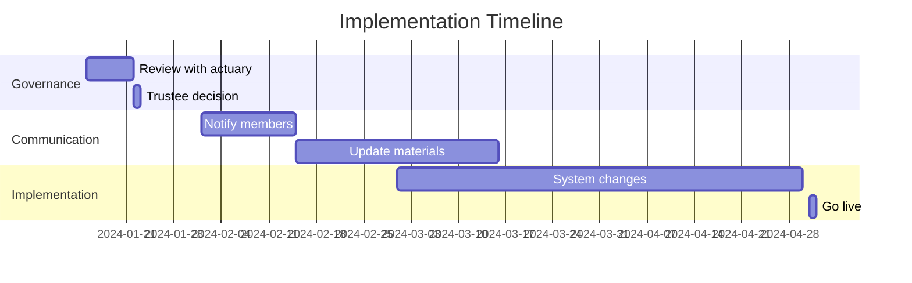

---
name: lgps-scheme-amendment-analyzer
description: Analyze LGPS scheme amendments, identify regulatory changes, compare against current rules, flag trustee notification requirements, extract member impact. Use when reviewing scheme amendments, regulatory changes, LGPS updates, trustee decisions. Keywords: LGPS, amendment, scheme rules, regulatory change, trustee, member benefits, scheme change.
allowed-tools: Read, Bash(grep:*), mcp__neo4j-psps__*, mcp__neo4j-cms-handbook__*, mcp__archon__rag_search_knowledge_base, mcp__archon__rag_read_full_page
model: claude-opus-4-5-20251101
context: fork
agent: general-purpose
---

# LGPS Scheme Amendment Analyzer

## Purpose

Analyze Local Government Pension Scheme amendments to identify regulatory implications, compare against existing scheme rules, assess member impact, and flag required trustee actions. Uses PSPS Neo4j database and CMS Handbook for comprehensive analysis.

## When to Use

- Reviewing new scheme amendments
- Comparing proposed changes against current rules
- Assessing impact on member benefits
- Identifying trustee notification obligations
- Checking compliance with LGPS regulations
- Preparing trustee briefing documents

## Available Resources

### Neo4j Databases
- **PSPS**: LGPS Regulations 2013, scheme rules, member benefits
- **CMS Handbook**: Trustee guidance, best practices, implementation advice

### Archon RAG
- Documentation search for LGPS guidance
- Code examples for benefit calculations
- Historical amendments and interpretations

## Amendment Analysis Workflow

### Phase 1: Document Intake

**Step 1: Load amendment document**
```
# Read amendment document
Read(file_path="[amendment-document]")

# Or if in SharePoint/email
[Extract text from source]
```

**Step 2: Extract key information**
Identify:
- Amendment reference number
- Effective date
- Regulations being amended
- Affected member categories (active/deferred/pensioner)
- Summary of changes

### Phase 2: Regulation Analysis

**Step 1: Search for affected regulations**
```
# Search Archon RAG for regulation context
mcp__archon__rag_search_knowledge_base(
  query="LGPS Regulations [regulation number]",
  match_count=5
)

# Get full regulation text
mcp__archon__rag_read_full_page(page_id="[from-results]")
```

**Step 2: Query current scheme rules**
```
# Find existing rules in PSPS database
mcp__neo4j-psps__read_neo4j_cypher(
  query="
    MATCH (r:Regulation)
    WHERE r.reference CONTAINS $regRef
    RETURN r.title, r.description, r.current_text, r.effective_date
  ",
  params={"regRef": "[regulation-number]"}
)
```

**Step 3: Compare old vs new**
Create comparison table:

| Aspect | Current Rule | Proposed Amendment | Impact |
|--------|--------------|-------------------|--------|
| [Topic] | [Current wording] | [New wording] | [Analysis] |

### Phase 3: Member Impact Assessment

**Step 1: Identify affected member types**
```
# Query member benefit calculations affected
mcp__neo4j-psps__read_neo4j_cypher(
  query="
    MATCH (b:Benefit)-[:AFFECTED_BY]->(r:Regulation)
    WHERE r.reference = $regRef
    RETURN b.name, b.calculation_method, b.member_type
  ",
  params={"regRef": "[regulation-number]"}
)
```

**Step 2: Assess impact categories**

Analyze impact on:

**Active Members**:
- Contribution rates
- Accrual rates
- Normal pension age
- Early retirement factors
- Death in service benefits

**Deferred Members**:
- Revaluation
- Early retirement terms
- Transfer values
- Deferred benefit calculations

**Pensioners**:
- Pension increases
- Commutation options
- Death benefits
- Survivor pensions

**Example impact assessment**:
```markdown
### Active Members
**High Impact**: Normal pension age changes from 65 to State Pension Age
- Affects retirement planning for all active members
- Transitional protections may apply (check Rule of 85)

**Medium Impact**: Contribution rates increase by 0.5%
- Impacts take-home pay
- Employer contribution rates unchanged

**Low Impact**: Administrative changes to AVC processes
- No impact on benefits, process improvements only
```

### Phase 4: Compliance & Trustee Actions

**Step 1: Check trustee obligations**
```
# Search CMS Handbook for trustee duties
mcp__neo4j-cms-handbook__read_neo4j_cypher(
  query="
    MATCH (g:Guidance)-[:COVERS]->(t:Topic)
    WHERE t.name CONTAINS 'amendments' OR t.name CONTAINS 'member notification'
    RETURN g.title, g.content, g.deadline_type
  "
)
```

**Step 2: Identify required actions**

Create action checklist:

```markdown
## Trustee Action Requirements

### Immediate (Within 14 days)
- [ ] Review amendment with scheme actuary
- [ ] Assess impact on scheme funding
- [ ] Check compatibility with scheme rules

### Short-term (Within 1 month)
- [ ] Notify members of changes (if material)
- [ ] Update member literature and website
- [ ] Brief administration team

### Medium-term (Within 3 months)
- [ ] Update scheme booklets
- [ ] Revise calculation procedures
- [ ] Train administration staff
- [ ] Update ABS statement templates

### Ongoing
- [ ] Monitor implementation
- [ ] Track member queries
- [ ] Review at next trustee meeting
```

**Step 3: Identify notification requirements**
```
# TPR notification obligations
- Material changes to benefits: Notify TPR within 30 days
- Changes to scheme rules: Submit to TPR for approval
- Member communication: Within reasonable time of change
```

### Phase 5: Historical Context

**Step 1: Search for similar past amendments**
```
mcp__archon__rag_search_knowledge_base(
  query="LGPS [topic] amendment history",
  match_count=10
)
```

**Step 2: Review implementation lessons**
Look for:
- Implementation challenges from similar changes
- Member communication examples
- Calculation precedents
- Dispute resolution cases

### Phase 6: Generate Analysis Report

**Report structure**:

```markdown
# LGPS Scheme Amendment Analysis
**Amendment**: [Reference number]
**Effective Date**: [Date]
**Analyst**: Claude Opus 4.5
**Analysis Date**: [Date]

## Executive Summary
[2-3 paragraph overview of changes and impact]

## Regulatory Changes

### Current Position
[What the regulation says now]
**Source**: LGPS Regulations 2013, Regulation [X]
**Effective**: [Date]

### Proposed Change
[What the amendment changes it to]
**Source**: [Amendment reference]
**Effective**: [Date]

### Rationale
[Why the change is being made, if stated]

## Member Impact Analysis

### Active Members
- **Impact Level**: [High/Medium/Low]
- **Affected Population**: [Number/percentage]
- **Key Changes**:
  - [Change 1]
  - [Change 2]
- **Financial Impact**: [Quantified if possible]

### Deferred Members
[Same structure]

### Pensioners
[Same structure]

## Scheme Funding Impact

[Analysis of impact on scheme liabilities and contribution rates]
**Recommendation**: Consult scheme actuary for detailed assessment

## Trustee Obligations

### Regulatory Requirements
- [TPR notification requirements]
- [Member communication requirements]
- [Documentation requirements]

### Recommended Actions
[Action checklist from Phase 4]

### Timeline


## Compliance Assessment

### Alignment with LGPS Regulations
- [✓] Complies with LGPS Regulations 2013
- [✓] Consistent with TPR guidance
- [✓] Aligns with CMS Handbook recommendations
- [?] Requires legal review: [Specific aspects]

### Risk Factors
| Risk | Severity | Mitigation |
|------|----------|------------|
| [Risk 1] | High/Med/Low | [Mitigation strategy] |

## Historical Precedents

[Similar amendments and lessons learned]

## Recommendations

1. **Immediate Actions**
   - [Action 1]
   - [Action 2]

2. **Strategic Considerations**
   - [Long-term implication 1]
   - [Long-term implication 2]

3. **Communication Strategy**
   - [Member communication approach]
   - [Stakeholder management]

## Supporting Documentation

### Regulations Referenced
- LGPS Regulations 2013, Regulation [X]
- [Amendment reference]
- TPR Code of Practice [X]

### Database Queries
- PSPS: [Node references]
- CMS Handbook: [Guidance references]

### RAG Sources
- [Page 1 title and URL]
- [Page 2 title and URL]

---

**Disclaimer**: This analysis is based on publicly available regulations and guidance. Trustees should consult their scheme actuary, legal advisors, and The Pensions Regulator for scheme-specific advice.

**Generated by**: Claude Opus 4.5 via LGPS Scheme Amendment Analyzer skill
**Date**: [Timestamp]
```

## Amendment Type Patterns

### Type 1: Benefit Changes
Examples:
- Normal pension age adjustments
- Accrual rate changes
- Early retirement factor revisions

**Focus areas**:
- Member impact quantification
- Transitional protections
- Contribution rate implications

### Type 2: Administrative Changes
Examples:
- AVC process updates
- Transfer procedures
- Nomination forms

**Focus areas**:
- Process improvement
- System updates required
- Training needs

### Type 3: Regulatory Compliance
Examples:
- GDPR alignment
- TPR code compliance
- Pension schemes act changes

**Focus areas**:
- Legal requirements
- Timeline constraints
- Documentation updates

### Type 4: Funding Changes
Examples:
- Contribution rate changes
- Deficit recovery adjustments
- Employer covenants

**Focus areas**:
- Actuarial input
- Employer communication
- Budget impact

## Key Regulations Quick Reference

### LGPS Regulations 2013

**Part 2: Scheme Membership**
- Reg 5: Eligible jobholders
- Reg 7: Opting out
- Reg 9: Qualifying service

**Part 3: Contributions**
- Reg 9: Contributions during employment
- Reg 10: Contributions during absence

**Part 4: Benefits**
- Reg 14: Retirement pensions
- Reg 30: Normal pension age
- Reg 31: Early payment of retirement pension

**Part 5: Death Benefits**
- Reg 40: Survivor pensions
- Reg 46: Death grants

### TPR Guidance References

**Code of Practice 14**: Governance and administration
- Section on scheme changes
- Member communication requirements
- Record keeping obligations

## Calculation Impact Examples

### Example 1: Normal Pension Age Change

**Before**: Age 65
```
Member aged 55, 20 years service
Pension = £20,000 × 20/60 = £6,667 p.a.
Available at 65 unreduced
```

**After**: State Pension Age (assume 67)
```
Same member
Pension = £20,000 × 20/60 = £6,667 p.a.
Available at 67 unreduced
Available at 65 with early retirement reduction:
£6,667 × 0.92 (approx) = £6,134 p.a.
```

**Impact**: £533 p.a. reduction if taken at 65

### Example 2: Accrual Rate Change

**Before**: 1/60th accrual
```
Member salary £30,000, 10 years service
Pension = £30,000 × 10/60 = £5,000 p.a.
```

**After**: 1/49th accrual (Career Average)
```
Assume inflation-adjusted avg salary £30,000
Pension = £30,000 × 10/49 = £6,122 p.a.
```

**Impact**: £1,122 p.a. increase (but method changed)

## Cross-Reference Checks

Always check:

1. **Scheme-specific rules**: Does fund have additional discretions?
2. **Employer policies**: Different employers may have variations
3. **Transitional protections**: Underpin guarantees, Rule of 85
4. **Historical amendments**: Similar changes in the past
5. **Related regulations**: Connected changes in other areas

## Common Pitfalls

**Pitfall 1: Missing transitional protections**
- Always check if existing members have protection
- Rule of 85 particularly important
- Underpin calculations for CARE vs final salary

**Pitfall 2: Overlooking employer variations**
- Some amendments allow employer discretions
- Check all employers in multi-employer funds

**Pitfall 3: Communication timing**
- Material changes must be communicated promptly
- Don't delay member notification for "perfect" materials

**Pitfall 4: System readiness**
- Ensure administration systems can handle changes
- Test calculations before go-live

**Pitfall 5: Incomplete impact analysis**
- Don't focus only on active members
- Deferred and pensioner impacts often overlooked

## Integration with Other Skills

- **pensions-research**: For deeper regulation analysis
- **pension-calculation-validator**: To verify calculation impacts
- **regulatory-deadline-tracker**: To manage implementation timeline
- **github-workflow**: For version control of analysis documents
- **conventional-commits-uk**: If tracking changes in git

## Quick Commands

```bash
# Search for amendment in documents
grep -ri "amendment" ~/Projects/pensions/documents/

# Find regulation references
grep -Eo "Regulation [0-9]+" amendment.txt

# Extract effective date
grep -i "effective\|commencing\|takes effect" amendment.txt
```

## Summary

This skill enables comprehensive analysis of LGPS scheme amendments by:
- Comparing proposed changes against current regulations (PSPS database)
- Assessing member impact across all categories
- Identifying trustee obligations (CMS Handbook)
- Generating detailed analysis reports
- Providing calculation examples
- Flagging compliance requirements

**Always use Opus model** for pension regulatory analysis due to complexity and high stakes.

The analysis ensures trustees have complete information to make informed decisions about scheme amendments.
