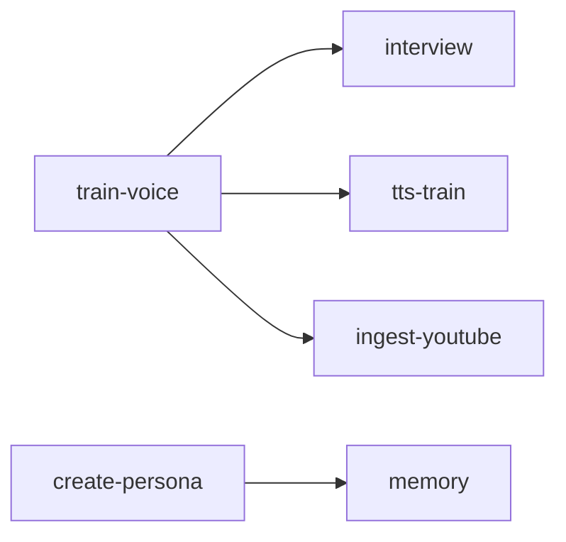

---
name: create-context
description: >
  Generate comprehensive CONTEXT.md for agent handoff. Captures current state,
  decisions, lessons learned, and next steps so another agent can continue
  with zero prior context.
allowed-tools: [Bash, Read, Write, Grep, Glob]
triggers:
  - create context
  - write context
  - handoff
  - context handoff
  - session summary
  - agent handoff
  - /create-context
metadata:
  short-description: "Generate CONTEXT.md for seamless agent handoff"
  author: "Horus"
  version: "1.0.0"

provides:
  - create-context
composes: [, task-monitor]
---

# create-context

Generate comprehensive CONTEXT.md files for agent handoff. Ensures another agent
can continue work with zero prior context.

## When to Use

- **Context window exhausted** - Before running out of context, capture state
- **Session end** - Document what was done before stepping away
- **Complex work** - Multi-session tasks need persistent context
- **Debugging** - Capture state before major changes
- **Handoff** - Explicitly transferring work to another agent/session

## Quick Start

```bash
cd .pi/skills/create-context

# Generate context for current session
./run.sh generate --focus "voice training skill"

# Generate with specific output path
./run.sh generate --output /path/to/CONTEXT.md

# Include git diff summary
./run.sh generate --include-git

# Interactive mode (asks clarifying questions)
./run.sh generate --interactive
```

## CONTEXT.md Structure

A complete context document includes:

### 1. Header Metadata

```markdown
# CONTEXT.md - [Project/Feature Name]

**Last Updated**: YYYY-MM-DD
**Session Focus**: Brief description
**Git Branch**: main (or feature branch)
**Agent**: Claude Opus 4.5 (or model used)
```

### 2. Current State

What exists now:
- Key files created/modified
- Features implemented
- Data/artifacts generated
- Storage locations

### 3. Decisions Made

Why things are the way they are:
- Architecture choices and rationale
- Trade-offs considered
- Alternatives rejected and why

### 4. Research Conducted

If any `/dogpile` or research was done:
- Queries run
- Key findings
- Sources consulted
- Insights applied

### 5. Lessons Learned

What worked and what didn't:
- Successful patterns
- Failed approaches
- Surprises encountered
- Best practices discovered

### 6. Known Issues / Gaps

What's incomplete or broken:
- Bugs discovered
- Missing features
- Technical debt
- Blocked work

### 7. Open Questions

Things needing clarification:
- User decisions needed
- Ambiguous requirements
- Design questions

### 8. Next Steps

Concrete actions for continuing:
- Immediate (this session)
- Near-term (next few sessions)
- Long-term (future work)

### 9. How to Continue

Exact commands and files:
- Commands to run
- Files to read first
- Environment setup needed
- Tests to verify state

### 10. Related Context

Links and dependencies:
- Related skills
- Documentation files
- External resources

## Auto-Detection Features

The skill automatically detects and includes:

| Element | Detection Method | Flag |
|---------|------------------|------|
| **Modified files** | `git status` and `git diff --stat` | always |
| **Recent commits** | `git log --oneline -10` | `--include-git` |
| **Architecture diagram** | Tree from modified files | always |
| **Key code snippets** | `# CONTEXT:`, `# KEY:`, `# IMPORTANT:` markers | `--include-snippets` |
| **Test coverage** | pytest + sanity.sh results | `--include-tests` |
| **Dependency graph** | Parses SKILL.md files for references | `--include-deps` |
| **Error log summary** | Scans log files and dogpile_errors.json | `--include-errors` |
| **Environment snapshot** | Relevant env vars (API keys masked) | `--include-env` |
| **Session transcript** | Finds .jsonl in ~/.claude/projects | `--include-transcript` |

### Key Code Markers

Mark important code for automatic inclusion:

```python
# CONTEXT: This function handles voice embedding extraction
def extract_embedding(audio_path: str) -> torch.Tensor:
    ...

# KEY: Critical algorithm - don't modify without tests
def calculate_suppression_level(f0_variance: float) -> float:
    ...

# IMPORTANT: This is the main entry point for voice design
def design_voice(persona: str) -> dict:
    ...
```

These markers are detected by `git diff` in recent commits and included in context.

## CLI Commands

### `generate` - Create CONTEXT.md

```bash
./run.sh generate [OPTIONS]

Options:
  --focus, -f TEXT       Session focus description
  --title, -t TEXT       Project/feature title
  --output, -o PATH      Output file path (default: local/docs/CONTEXT.md)
  --interactive, -i      Ask clarifying questions
  --full                 Include ALL optional elements

Detection Options (all default to true except --include-tests):
  --include-git          Include git status and commits
  --include-tests        Run and include test results (slower)
  --include-deps         Include skill dependency graph
  --include-env          Include environment snapshot (API keys masked)
  --include-errors       Include error log summary
  --include-snippets     Include key code markers (CONTEXT:, KEY:, IMPORTANT:)
  --include-transcript   Include session transcript path
```

### Examples

```bash
# Quick context with defaults
./run.sh generate --focus "voice training skill"

# Full context with everything
./run.sh generate --full --title "Voice Training System"

# Interactive mode for detailed handoff
./run.sh generate --interactive --include-tests

# Minimal context (just git + modified files)
./run.sh generate --no-include-deps --no-include-env --no-include-errors
```

### `validate` - Check CONTEXT.md completeness

```bash
./run.sh validate [PATH]

# Checks for:
# - All required sections present
# - Next steps are actionable
# - No placeholder text remaining
# - Links resolve correctly
```

### `diff` - Show changes since last context

```bash
./run.sh diff

# Compares current state to last CONTEXT.md
# Shows what's new/changed/removed
```

## Templates

### `default` - Standard handoff

All sections, balanced detail.

### `minimal` - Quick checkpoint

Just: Current State, Known Issues, Next Steps, How to Continue.

### `detailed` - Major milestone

All sections plus: Architecture diagrams, Code snippets, Performance notes.

### `research` - Research session

Emphasizes: Research Conducted, Lessons Learned, Open Questions.

## Best Practices

### When to Generate

1. **Every 2-3 hours** of complex work
2. **Before major refactors** - capture "before" state
3. **After completing milestones** - document what works
4. **Before context exhaustion** - don't lose work
5. **At natural breakpoints** - end of feature, fixed bug

### What to Capture

**Always include:**
- Exact file paths modified
- Commands that worked
- Error messages encountered
- Decisions and their rationale

**Avoid:**
- Obvious/trivial details
- Redundant information
- Temporary debugging notes
- Personal opinions without context

### Writing Style

- **Be specific**: "Modified line 423 of foo.py" not "updated foo"
- **Be actionable**: "Run `./test.sh` to verify" not "tests might work"
- **Be honest**: Document failures and gaps, not just successes
- **Be structured**: Use consistent formatting

## Memory + Taxonomy Integration

Context snapshots are automatically stored in `/memory` with `/taxonomy` bridge tags for
recall, versioning, and delta/drift detection across sessions.

### How It Works

**Pre-hook (recall):** Before generating a new CONTEXT.md, the skill queries memory for
prior context snapshots of the same project. This surfaces what changed since the last
handoff (delta/drift detection).

**Post-hook (learn):** After writing CONTEXT.md, the skill learns to memory:
1. **Context snapshot** — project, date, branch, focus, file counts
2. **Decisions** — individually stored for fine-grained recall
3. **Lessons learned** — cross-project value
4. **Known issues** — for drift tracking over time

All entries are tagged with taxonomy bridge attributes (Precision, Resilience, Fragility,
etc.) extracted from the content.

### CLI Commands

```bash
# Recall prior contexts for a project
./run.sh recall "voice-training"

# Recall with more results
./run.sh recall "voice-training" -k 5
```

### Graceful Degradation

Memory and taxonomy are optional dependencies. If unavailable:
- Pre-hook returns empty string (no prior context shown)
- Post-hook silently skips (context still generated normally)
- Bridge extraction falls back to keyword matching

## Integration with Other Skills

| Skill | Integration |
|-------|-------------|
| `/assess` | Run before context to identify gaps |
| `/dogpile` | Include research summaries |
| `/handoff` | Uses create-context output |
| `/episodic-archiver` | Archives full session transcripts |
| `/memory` | Stores context snapshots for recall and drift detection |
| `/taxonomy` | Bridge tags attached to all memory entries |

## Example Output

```markdown
# CONTEXT.md - Voice Training System

**Last Updated**: 2026-02-08
**Session Focus**: /train-voice skill with research-backed voice design
**Git Branch**: main

## Current State

### Built This Session
- `.pi/skills/train-voice/` - Unified voice training skill
- Updated `create-persona/src/persona.py` with historical context fields

### Key Artifacts
- `/mnt/storage12tb/media/personas/embry/personaplex/voices/*.pt`
- Qwen3-TTS trained model (5 epochs)

## Decisions Made

1. **Two-path architecture**: Known voices (auto-discover) vs unknown (interview)
   - Rationale: Can't always find audio for historical figures

2. **Layered emotional texture**: Formative/Prime/Later life events
   - Rationale: Age at event affects how it manifests in voice

## Research Conducted

Three dogpile searches:
1. Trauma/suppression vocal biomarkers → F0 variability, jitter metrics
2. Cultural emotional norms → Suppression levels by culture
3. Grief processing markers → Acute vs integrated patterns

## Known Issues

- [ ] `run.sh` commands not fully implemented
- [ ] `/interview` skill integration uses fallback

## Next Steps

### Immediate
- Test `design.py` with Marcus Aurelius

### Near-Term
- Implement full run.sh routing
- Expand accent database

## How to Continue

```bash
# Check what exists
ls .pi/skills/train-voice/

# Run the design interview
cd .pi/skills/train-voice
python design.py "Marcus Aurelius"

# Verify persona schema
grep -A 50 "Historical & Cultural" .pi/skills/create-persona/src/persona.py
```

## Architecture

```
Modified Structure:
├── .pi/
│   ├── skills/
│   │   ├── train-voice/
│   │   └── create-persona/
```

## Key Code Snippets

**design.py** - CONTEXT:
```
# CONTEXT: Cultural suppression levels affect baseline voice parameters
CULTURAL_EMOTIONAL_NORMS = {...}
```

## Test Status

- 47 tests collected
- Sanity checks: train-voice: pass, create-persona: pass

## Skill Dependencies



## Environment

| Variable | Value |
|----------|-------|
| `VOICE_STORAGE` | `/mnt/storage12tb/media/personas` |
| `ANTHROPIC_API_KEY` | `sk-ant-...XXXX` |

## Session Transcript

Full conversation history: `~/.claude/projects/.../13e7bdff-520a-4bc9-a9b9-eae067fb0de3.jsonl`
```

## Environment Variables

| Variable | Description | Default |
|----------|-------------|---------|
| `CONTEXT_OUTPUT_DIR` | Default output directory | `local/docs` |
| `CONTEXT_TEMPLATE` | Default template | `default` |
| `CONTEXT_INCLUDE_GIT` | Auto-include git info | `true` |

## Files

```
.pi/skills/create-context/
├── SKILL.md                # This file
├── run.sh                  # Entry point
├── context.py              # Main generator
├── memory_integration.py   # Memory + taxonomy hooks
├── detectors.py            # Auto-detection functions
├── renderer.py             # Markdown rendering
├── templates/
│   ├── default.md          # Standard template
│   ├── minimal.md          # Quick checkpoint
│   ├── detailed.md         # Major milestone
│   └── research.md         # Research session
└── sanity.sh
```
