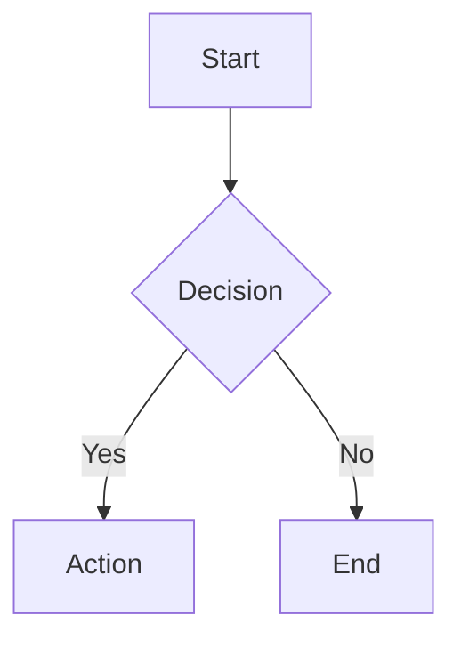
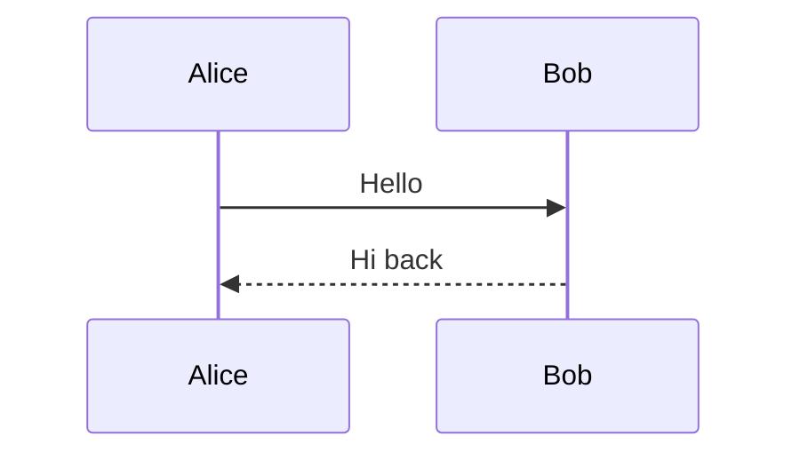
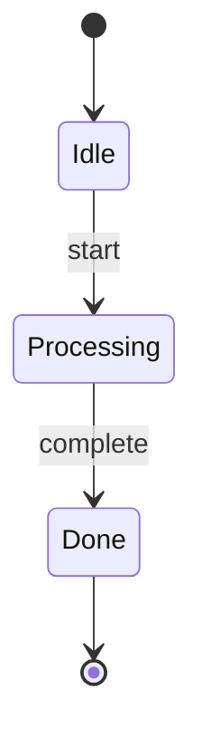
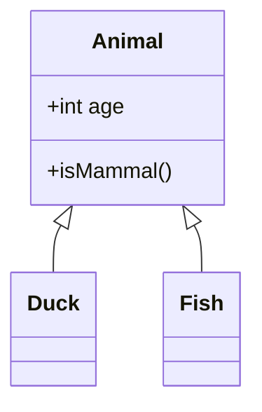
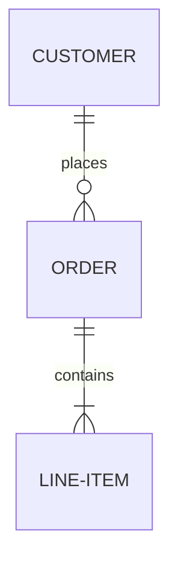
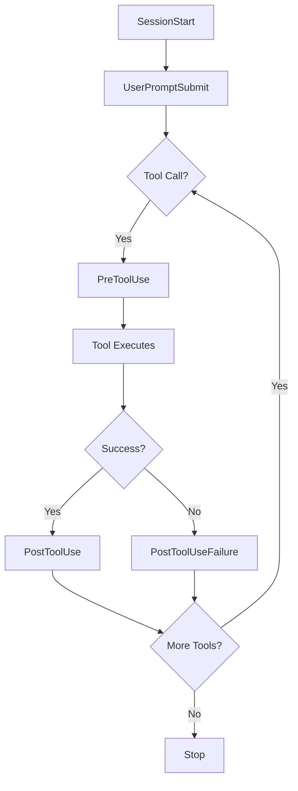

# Mermaid Diagrams

```ssl
[mermaid] visualize→ASCII|SVG | via beautiful-mermaid

supported: flowchart, state, sequence, class, ER
output: terminal-friendly ASCII or SVG file
themes: 15 built-in (tokyo-night, github-dark, etc.)
```

## Usage

When user asks for a diagram, architecture visualization, or flowchart:

1. **Write the Mermaid code** based on their description
2. **Render as ASCII** for immediate terminal display
3. **Optionally save SVG** if user wants a file

## Mermaid Syntax Quick Reference

### Flowchart


### Sequence Diagram


### State Diagram


### Class Diagram


### ER Diagram


## Rendering

Use the `mermaid-render` script to render diagrams:

```bash
# ASCII output (terminal)
mermaid-render ascii "graph LR; A --> B --> C"

# SVG output (file)
mermaid-render svg "graph TD; A --> B" output.svg

# With theme
mermaid-render svg "graph TD; A --> B" output.svg --theme tokyo-night
```

### Available Themes
- tokyo-night (default)
- github-dark
- github-light
- dracula
- monokai
- nord
- one-dark
- solarized-dark
- solarized-light
- gruvbox-dark
- gruvbox-light
- catppuccin-mocha
- catppuccin-latte
- rose-pine
- rose-pine-dawn

## Process

1. **Understand the request** - What needs to be visualized?
2. **Choose diagram type** - flowchart, sequence, state, class, or ER
3. **Write Mermaid code** - Use proper syntax
4. **Render** - Show ASCII in response, offer SVG if complex

## Example

User: "Show me the hook lifecycle"



Then render as ASCII for terminal display.
