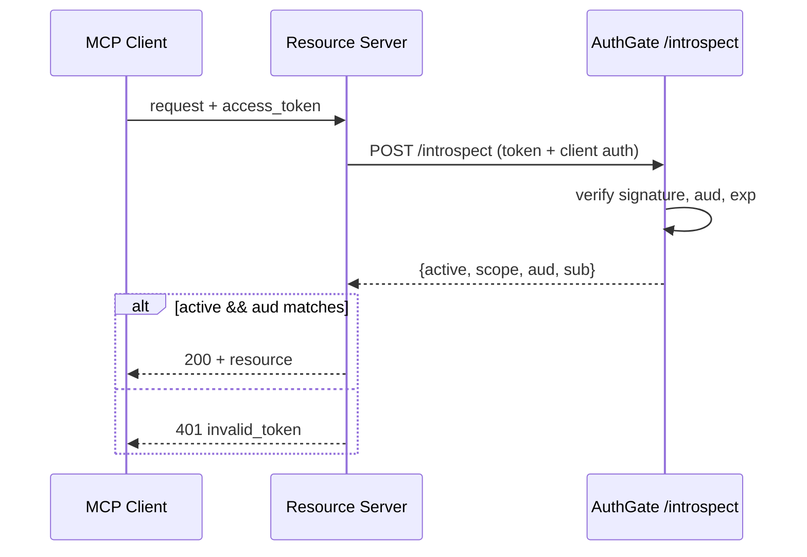

# pr-prepare

Most PRs that contain AI-authored code skip the disclosure that reviewers need to evaluate them properly. This skill produces PR descriptions that make AI authorship, change classification, and verification status explicit — so reviewers know which sections need line-by-line attention and which can be spot-checked. It also draws the change as a diagram, because reviewers grasp structure far faster from a picture than from a file list.

## When to use

Use whenever the user is about to open or push a PR. Triggers include:

- "Prepare a PR / open PR / push for review"
- "Write a PR description"
- "I'm done with the feature, ready to ship"
- "What should I put in the PR description"
- Any time the user mentions merging, pushing, or pulling-request a branch

Skip only if the user explicitly says "I'll write the PR myself" or wants raw diff output.

## Workflow

### Step 1 — Read the change

Use Bash to gather:

- `git status` — what's staged / dirty
- `git log <base>..HEAD --oneline` — commit messages on the branch
- `git diff <base>...HEAD --stat` — file-level summary
- `git diff <base>...HEAD` for any small files; for large diffs, sample changed sections

While reading, note the _shape_ of the change as well as its content — which files/packages/services are new, which are modified, and how they call each other. This is the raw material for the diagram in Step 6.

If `<base>` isn't obvious, ask the user (commonly `main` or `develop`).

### Step 2 — Ask about AI authorship

Ask the user explicitly (don't infer):

> "Did AI tools (Claude, Cursor, Copilot, etc.) write any of this code? If yes, which files, and which files did you review line-by-line yourself?"

Record:

- **AI-authored files**: which ones
- **Human line-by-line reviewed**: which ones
- **Tool used**: e.g., "Claude Sonnet via Cursor"

If the user says "I don't remember", flag this as a problem — they should know before submitting.

### Step 3 — Classify the change

Determine if the change is `leaf` or `core`:

- **Leaf node**: nothing else depends on it. Reports, single endpoints, UI components, scripts, one-off migrations. Failure is local.
- **Core code**: many things depend on it. Auth, payments, data schema, shared frameworks, public APIs, orchestrators. Failure is system-wide.

If the change touches both, mark it `core` (the stricter rules apply to the whole PR).

If unsure, ask the user a quick diagnostic: "If this code is buggy, how far would the failure spread?"

### Step 4 — Detect verification

Look at the diff for:

- Tests added or modified (count them)
- Whether tests are end-to-end or implementation-coupled
- Whether stress / soak tests exist for long-running code
- Whether logs / metrics were added to important paths

If the change is core or has fewer than 3 tests, surface this to the user before generating the PR description — they may need to add tests first.

### Step 5 — Run pre-submit checklist

Before producing the PR text, walk through this checklist with the user. Ask only about items that aren't obviously satisfied from the diff:

- [ ] A plan exists — plan.md or at least a written goal + scope (required even for leaf work, though it can be lightweight; code review will bounce a PR that has none)
- [ ] PR is scoped (< 500 lines for human-reviewable; if larger, was this coordinated in advance?)
- [ ] All tests pass locally
- [ ] No secrets / API keys / credentials in the diff
- [ ] The `must not modify` boundary from the plan was respected (if there was a plan)
- [ ] If touching auth / payment / external API: extra security review done

If anything fails, stop and surface it. Do not produce the PR description for a PR that shouldn't be opened yet.

### Step 6 — Map the change as a diagram

A diagram beats a paragraph for showing _how the change fits together_. Draw it as a **Mermaid** diagram: GitHub renders Mermaid natively in PR bodies (GitLab and Gitea do too), so it travels inside the description with no image hosting and diffs cleanly when the architecture changes. The rendering rules below are GitHub's — the strictest of the common hosts — so a diagram that satisfies them renders everywhere; on other hosts you can relax them (e.g. Gitea honors `%%{init}%%` themes and larger graphs).

Pick the diagram type from what the change actually _is_:

| The change is mainly about…                                                                                  | Use               | Mermaid header                                |
| ------------------------------------------------------------------------------------------------------------ | ----------------- | --------------------------------------------- |
| Interactions/handshakes over time (auth flow, request lifecycle, calls between services / MCP client↔server) | Sequence diagram  | `sequenceDiagram`                             |
| Control flow, decision logic, or a pipeline (branching, data transform, CI steps)                            | Flowchart         | `flowchart TD`                                |
| New or rewired modules / packages / services (structural dependencies)                                       | Component diagram | `flowchart LR` with one `subgraph` per module |
| A state machine (status transitions, token / job lifecycle)                                                  | State diagram     | `stateDiagram-v2`                             |

Rules that keep the diagram honest and renderable:

- **Derive every node from the diff, not from imagination.** Each box must map to a file, function, package, or service the PR actually touches. If you can't trace a node back to a changed line, delete it. A diagram of the _ideal_ architecture instead of the _actual_ change misleads reviewers — the same failure mode as a vague "fixes the bug" summary.
- **Mark what changed.** Give new/modified elements a distinct node style, e.g. `style NewSvc fill:#dff0d8,stroke:#3c763d`, and leave the surrounding existing code the diff plugs into in the default style so the boundary is obvious. Per-node `style` lines work; `%%{init: ...}%%` theme directives do **not** — GitHub strips them.
- **Stay under ~15–20 nodes.** GitHub falls back to plain text (or times out) on very large/complex diagrams. If the change won't fit in that budget, that's a signal the PR should probably be split (see Anti-patterns).
- **Prefer `TD` over `LR` when wide.** GitHub renders inside the markdown column; wide diagrams force horizontal scroll on desktop and overflow on mobile. Group related nodes in `subgraph` blocks so they wrap.
- **No `click` handlers / interactivity** — GitHub renders a static SVG and ignores them.

If the change is genuinely trivial (one-line fix, copy tweak, dependency bump), skip the diagram and say so — don't draw a one-box graph.

### Step 7 — Produce the PR description

Use this template, filling in everything you know. Leave clearly-marked TODO placeholders only when you don't have the information. The `Architecture / flow` block sits right after the summary so reviewers see the shape before the details.

````markdown
## Summary

<1-3 sentences: what this PR does and why>

## Architecture / flow

<Mermaid diagram of the change. Omit this section for trivial changes.>



## AI Authorship

- [ ] No AI was used in this PR
- [x] AI was used. Details:
  - **Tool / model**: <e.g., Claude Sonnet via Cursor>
  - **AI-authored files**: <list>
  - **Human line-by-line reviewed**: <list>

## Change classification

- [ ] Leaf node (local impact)
- [x] Core code (broad impact — needs line-by-line review)
      <or vice versa>

## Plan reference

<link to plan.md, or paste its goal + scope section>

## Verification

- [x] Unit tests
- [x] Integration tests
- [x] At least 3 e2e tests (1 happy path + 2 errors)
- [ ] Stress / soak test: <details, or N/A>
- Manual verification: <steps the reviewer should run>

## Verifiability check

- [x] Inputs and outputs are documented
- [ ] Reviewer can judge correctness from interface + tests alone (leaf only — core still needs line-by-line review)
- [x] Failures will surface in monitoring

## Security check (only if PR touches external interfaces)

- [ ] No secrets in code
- [ ] All external inputs validated
- [ ] Permission checks tested
- [ ] Rate limits applied
- [ ] Errors don't leak internals

## Risk & rollback

- **Risk**: <what could break>
- **Rollback**: <how to revert>

## Reviewer guide

- **Read carefully**: <files / functions that need close attention>
- **Spot-check OK**: <files / functions where tests + signatures suffice>
````

### Step 8 — Hand off

After producing the description, tell the user:

1. Where to paste it (typically the GitHub PR body)
2. Suggested reviewer count: 1 for leaf, 2+ for core (including the module owner)
3. Suggest a quick render check — paste the Mermaid block into the GitHub PR preview (or the Mermaid Live Editor) to confirm it renders before submitting.
4. If `gh` CLI is available and the user wants, offer to run `gh pr create --body-file <file>` directly.

## Anti-patterns to flag

If you see any of these in the diff, raise them BEFORE producing the PR text. The user may want to fix them first.

- AI authored code in core paths with no human line-by-line review noted
- No tests, just "I tested it locally"
- AI authorship not disclosed
- Touches files outside the announced scope (if there was a plan.md)
- Cross-module sprawling diff suggesting it should be split into multiple PRs
- Long-running / async code with no stress test
- A diagram with nodes that don't map to changed code (architecture fiction) — fix the diagram before producing the PR text

## Output principles

- **Be specific.** Don't write "fixes the bug" — write what bug, in what file, by what mechanism.
- **Show the shape.** A diagram of what changed beats a paragraph describing it — but only when every node maps to real changed code.
- **Match existing PR style** if the repo has a convention. Read recent merged PRs if uncertain.
- **Lead with what's risky.** Reviewers should immediately see what to scrutinize.
- **Honest about AI.** Reviewers calibrate effort based on this. Hiding AI authorship is the single biggest source of bad reviews.
