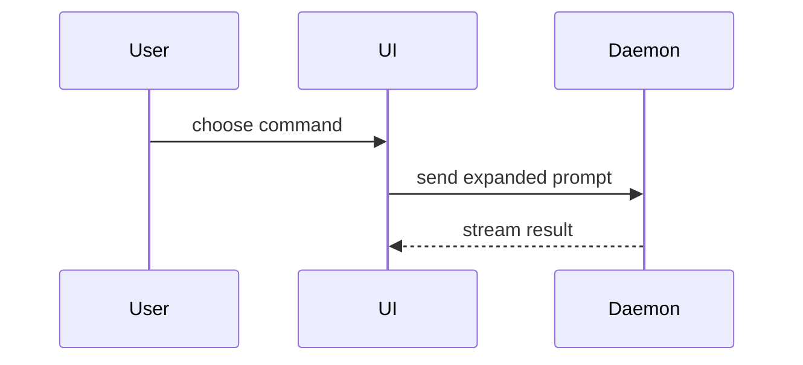

Answer with the smallest view that carries the point. Skip the preamble. Keep prose to the line or two the visual needs, and cut every call, file, prop, state, and boundary the current question does not turn on.

## Pick the view

| The point is | View |
|---|---|
| logic or an algorithm | pseudocode |
| what calls what at runtime | call tree |
| UI structure, with the state and module boundaries that matter | component tree |
| file responsibility, or the shape of a broad refactor | shallow file tree |
| interaction, control flow, or data flow between parts | diagram |
| a change against a shape that already exists | diff |
| new code, or a shape worth copying | whole block |

Ship the fewest views that answer the question. One view is the common case; a compound question takes two.

## Shapes

Pseudocode:

```text
on(save)
  if content is unchanged
    return cached result
  write new content
  return fresh result
```

Call tree:

```text
submitForm
  createSession
    persistPrompt
    launchAgent
  navigateToSession
```

Component tree, naming the file that owns each boundary:

```tsx
<OrderPage> (src/routes/order.tsx)
  useOrderEvents()
  <OrderToolbar>
    <RetryButton> (packages/ui)
```

Shallow file tree, one comment per directory saying what it owns:

```text
src/
├── commands/       # parses user actions
├── sessions/       # owns session state
└── transport/      # sends API requests
```

Diagram. Mermaid and nomnoml are both available; pick per diagram.



Whole block, when most of it is new or the surrounding context would hide ownership or order:

```python
def expand_skill(command: str) -> str:
    return f"use the {command.removeprefix('/')} skill"
```

## Diffs

Reach for a diff when the point is what changes and the shape around it already exists. Match the diff to the view it changes.

A component change:

```diff
 <OrderPage>
   useOrderEvents()
   <OrderToolbar>
+    <RetryButton />
   <OrderTimeline>
+    <RetryResultCard />
```

A file-layout change:

```diff
 src/
 ├── commands/
+│   └── show-me.ts       # expands the slash command
 ├── sessions/
-└── transport.ts
+└── transport/
+    ├── client.ts
+    └── stream.ts
```

A call-tree change:

```diff
 submitForm
   createSession
     persistPrompt
+    expandSkillMention
     launchAgent
-  navigateToSession
+  navigateToSession
+    subscribeToEvents
```

A control-flow change:

```diff
 on(save)
-  write content
+  if content is unchanged
+    return cached result
+  write new content
+  invalidate cache
```

## Placement

Put each visual next to the short text it supports, not in a block of its own at the end.

## Boundaries

- Nothing here lands on disk. Every view is chat output.
- A diagram that must live in a document goes to `diagram-contract`, which owns the tool choice, the house palette, and the committed SVG beside its source.
- A layout or state comparison the user needs to click goes to `prototype-logic`.
- A concept being taught, rather than a current topic being shown, goes to `explain-concept`.
