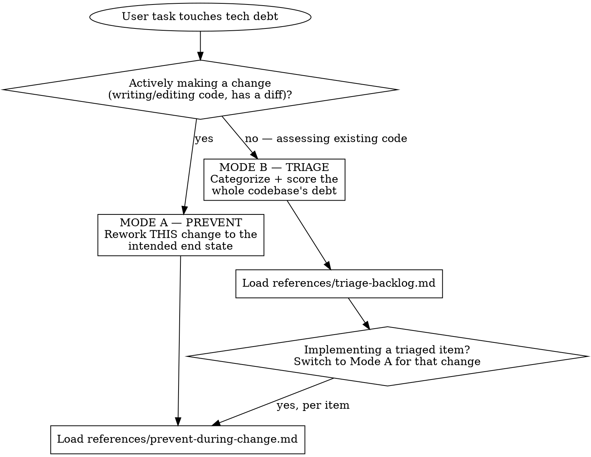

# Tech Debt

## Overview

Two complementary stances on technical debt, picked apart by the router in this file:

- **Mode A — Prevent:** while you're *making a change*, rework it toward the intended end state. Delete the dead compatibility path instead of preserving it.
- **Mode B — Triage:** while you're *assessing existing code*, categorize, score, and prioritize the debt into a remediation plan.

They run at different points in a debt's lifecycle: prevent when writing, triage when planning. Triage output feeds back into prevent, one item at a time.

## When to use

Use Mode A when:

- You are implementing, finishing, or reviewing a feature / fix / refactor and the user wants the change clean.
- You're about to keep a fallback, alias, mode flag, or wrapper "just in case" — check it has a caller first.
- The user says "do this properly", "no bandaids", "zero tech debt", or "don't leave a mess".

Use Mode B when:

- The user asks for a tech-debt audit, code-health review, or "what should we refactor?"
- The user wants to prioritize a maintenance / refactor backlog or roadmap.
- Debt has accumulated and nobody is sure what to fix first.

**When NOT to use:**

- A single obvious local fix with no structural angle — just fix it; don't invoke a debt framework.
- Style/formatting nits — point them at the linter/formatter, not here.
- Greenfield where the intended end state is genuinely unknown (Mode A can't target what isn't defined yet).

## How this skill works — router

**This skill is a ROUTER.** This file stays a thin orchestrator. It picks exactly one mode (or the chain A→B→A), then you **load the matching `references/*.md` and follow it.** The two reference docs hold the actual steps, rules, and examples.

**Never inline a reference doc's body.** If a branch is more than a 2–3 line summary, it belongs in `references/`. The decision of *which* branch to take stays here.

Why: keeping the router thin keeps it scannable, and loading the branch body only when the mode is confirmed saves context on the wrong branch.

## Routing

Decision criterion — one boolean property of the task: **Is the user actively making a change right now** (writing/editing code, has a diff)? `yes` → Mode A; `no` → Mode B. The chain rule: once a triaged item is being implemented, switch to Mode A for that change.

### Routing table

| If the user is… | Mode | Load |
|---|---|---|
| implementing/finishing a feature, fix, or refactor and wants the change clean | A | `references/prevent-during-change.md` |
| about to preserve a fallback/alias/flag "just in case" | A | `references/prevent-during-change.md` |
| asking for a tech-debt audit / "what should we refactor" / code-health review | B | `references/triage-backlog.md` |
| asking to prioritize a maintenance or refactor backlog | B | `references/triage-backlog.md` |
| fixing an item that came out of a triage | A (per item) | `references/prevent-during-change.md` |

## Mode A — Prevent (during a change)

Rework the change from the **intended end state**, not the path that led to the current patch. Optimize for the code that *should* exist; delete dead compatibility paths rather than improving them. Prefer one clear component/flow over mode flags.

**Load `references/prevent-during-change.md` and follow it.**

## Mode B — Triage (audit a backlog)

Systematically identify, categorize, and prioritize existing debt across the codebase. Produce a prioritized list with effort estimates and a phased remediation plan that can run alongside feature work.

**Load `references/triage-backlog.md` and follow it.**

## Bottom line

Prevent new debt while you're changing the code; triage old debt when you're planning what to fix.
