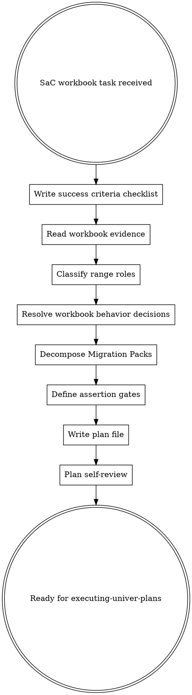

# Writing Univer Plans

Write the workbook-domain success criteria and plan before any SaC assertion or migration source
work. The success criteria locks the target outcome as a checklist. The plan is a source-first
authoring artifact, not chat-only notes.

This is not generic software planning. The plan exists to make spreadsheet behavior explicit:
Excel-domain meaning, range roles, formulas, formatting, validation, preservation boundaries, and
assertion gates.

<EXTREMELY-IMPORTANT>
If complex SaC workbook behavior is involved, you MUST write or update the workspace plan before
writing `assertions.ts` or editing Migration Packs.

IF THIS SKILL APPLIES, SUCCESS CRITERIA FIRST. PLAN SECOND. ASSERTIONS THIRD. MIGRATION SOURCE FOURTH.
</EXTREMELY-IMPORTANT>

## The Rule

Decide workbook behavior in source before executing it.



Do not write the plan before writing or updating the success criteria.
Do not write `assertions.ts` before the plan.
Do not edit Migration Packs before plan-derived assertions.
If you already did any step out of order, stop, write the missing success criteria and plan from
current workbook evidence, then restart execution from the plan.

## Success Criteria First

Before writing the workspace plan, create or update:

```text
<package.univer>/project/success-criteria/<topic>.md
```

This file is a short checklist, not a plan. It translates the user task into pass conditions before
heavy workbook reasoning starts.

Use this shape:

```md
# <Feature Name> Success Criteria

**Task:** <one-sentence restatement of the user task>
**Source:** <workbook/package, user prompt, files, or commands that define the task>

## Success Checklist

- [ ] <user-visible outcome>
- [ ] <preservation or negative constraint>
- [ ] <required deliverable or output>
- [ ] <validation signal>

## Explicit Non-Goals

- [ ] <out-of-scope behavior>

## Ambiguities To Resolve In Plan

- <question the plan must resolve with evidence, probes, or an explicit assumption>
```

Success criteria may name visible outcomes, preservation constraints, required deliverables,
validation signals, explicit non-goals, and ambiguities.

- Do not include Migration Packs.
- Do not include assertions.ts design.
- Do not include TDD steps.
- Do not include apply/verify repair strategy.
- Do not include formula/range mapping decisions that require workbook evidence; list those as
  ambiguities for the plan instead.

## Hard Gate

A plan is complete only when it can drive assertion-first implementation.

- Do not leave workbook meaning as chat-only notes.
- Do not start Migration Packs from intuition about "what spreadsheets usually do."
- Do not treat examples, answer ranges, or preview windows as target output without recording why.
- Do not mark ambiguous domain decisions as proven when they are assumptions.
- Do not hand off to execution while any changed pack lacks an assertion gate.
- Do not hand off until the plan identifies workbook behavior contract choices for complex behavior.

## Scope Check

Before writing pack tasks, check whether the request is one coherent workbook behavior or several
independent workbook deliverables.

Split into separate plans when the task contains independent sheets, source models, report families,
or workflows that can be verified and delivered separately. Keep one plan only when the packs share
one workbook-visible goal and one coherent verify command.

If scope is too broad, stop and ask which workbook deliverable should be planned first. Do not create
a giant plan that hides independent assertion gates.

## Source File Map

Before defining pack tasks, map the files the plan expects execution to touch:

- Success Criteria: `<package.univer>/project/success-criteria/<topic>.md`
- Plan: `<package.univer>/project/plans/<topic>.md`
- Assertions: `<package.univer>/project/migrations/<pack>/assertions.ts`
- Migration Packs: `<package.univer>/project/migrations/<pack>/`
- Fixtures or readonly probes: exact workbook paths, sheets, ranges, or commands used as evidence

For each file, state its responsibility. This locks the boundary between workbook intent,
assertions, migration source, and evidence before execution starts.

## Output Location

Write or update the success criteria and plan files under the SaC workspace:

```text
<package.univer>/project/success-criteria/<topic>.md
<package.univer>/project/plans/<topic>.md
```

Use an existing project naming convention if one exists. Keep the success criteria close to the plan
so future agents can distinguish the target checklist from the reasoning and execution design.

## Plan Document Header

Every plan MUST start with this header:

```md
# <Feature Name> Univer Plan

> **For agentic workers:** REQUIRED SUB-SKILL: Use `executing-univer-plans` to
> execute this plan pack-by-pack. Each non-trivial changed Migration Pack needs
> plan-derived assertions before implementation.

**Goal:** <one sentence describing the workbook-visible outcome>

Success Criteria: <package.univer>/project/success-criteria/<topic>.md

**Workbook Contract:** <2-3 sentences describing the spreadsheet behavior, not code structure>

**Execution Scope:** <Migration Packs, assertions, and verify command involved>

---
```

## Required Plan Shape

```md
## Workbook Intent

- User-visible outcome:
- Explicit non-goals:

## Baseline Evidence

- Source already read:
- Readonly probes:
- Unknowns:

## Source File Map

- Success Criteria:
- Plan:
- Assertions:
- Migration Packs:
- Fixtures/probes:

## Range Roles

- Source data:
- Target output:
- Helper/control input:
- Lookup/reference:
- Example/demo:
- Existing output:
- Preserve-only:

## Workbook Behavior Contract

- Visible target/state:
- Source/input dependency:
- Shape/layout boundary:
- Ordering/grouping/mapping policy:
- Value/formula semantics:
- Formatting/presentation semantics:
- Interaction/validation/protection behavior:
- Preservation and negative constraints:
- Example/demo/answer-range handling:

## Contract Decision Evidence

| Decision | Chosen rule | Plausible wrong rule | Discriminating evidence | Evidence strength | Assertions/probes |
| --- | --- | --- | --- | --- | --- |
|  |  |  |  |  |  |

## Migration Packs

1. `<pack-id>`: durable workbook intent
   - reads:
   - writes:
   - must preserve:
   - rollback/verify boundary:
   - assertion gate:

## TDD Gates

- Assertions to write or update first:
- Allowed bootstrap/probe:
- Completion verify command:

## Pack Tasks

### Task 1: `<pack-id>`

**Files:**
- Plan: `<package.univer>/project/plans/<topic>.md`
- Test: `<package.univer>/project/migrations/<pack>/assertions.ts`
- Migration: `<package.univer>/project/migrations/<pack>/`

- [ ] **Step 1: Write the failing assertion**
- [ ] **Step 2: Run verify and confirm expected failure**
- [ ] **Step 3: Implement the minimal Migration Pack change**
- [ ] **Step 4: Run verify and confirm pass**
- [ ] **Step 5: Commit or prepare handoff**
```

## Range Role Rules

For every relevant range role, say whether the migration may read it, write it, replace it, or must
preserve it.

Range roles include source data, target output, helper/control input, lookup/reference, example/demo,
existing output, and preserve-only areas.

Source data, helper/control input, lookup/reference, example/demo, existing output, and preserve-only
ranges are not target output unless the user explicitly says to change them. If an example/demo range
is used to infer a formula, layout, or behavior, capture that reasoning in the plan and add assertion
gates that distinguish the real target output from the example.

Answer ranges and output ranges are constraints and evidence windows. They do not prove that the
top-left cell is the output start or that the range contains the full contract.

## Workbook Behavior Contract Rules

For complex workbook behavior, fill the relevant Workbook Behavior Contract fields before editing
migration source. The contract should turn ambiguous workbook-visible behavior into explicit plan
choices that assertions can verify.

Output-heavy transformations should capture shape, mapping, ordering, grouping, truncation, and
value/formula semantics. Formatting, validation, protection, chart, comment, layout, or sheet
structure changes should capture visible state, presentation or interaction semantics, preservation
rules, and negative constraints.

## Contract Decision Evidence Rules

For every high-risk or non-obvious workbook behavior decision, record evidence before editing
migration source.

High-risk decisions include ordering precedence, grouping and truncation order, source-to-target
mapping, sign-to-column mapping, singular/plural label wording, blank-versus-zero-versus-error
policy, date-window inclusive boundaries, malformed color handling, text casing or whitespace
preservation, header or section-boundary handling, formula-versus-static-value strategy, and any
behavior where the instruction can reasonably be read in more than one way.

Exact workbook-visible value preservation is itself a behavior decision. When text, spaces,
punctuation, identifiers, date values, boolean values, number/text typing, blanks, zeroes, or error
placeholders are visible, the plan must say whether they are preserved exactly or intentionally
transformed. Do not normalize values just because the normalized form looks cleaner or more
conventional.

- Do not write `Unknowns: none` when a decision depends on domain intuition, ambiguous wording,
  partial preview data, or an unchecked sample/reference pattern.
- If multiple interpretations are plausible, list the rejected interpretations and why they lost.
- If the chosen rule is based on workbook-visible evidence, name the source range or cells.
- If the chosen rule is based only on instruction wording, quote the deciding phrase in the plan.
- If no decisive evidence exists, mark the decision as an assumption and choose the rule that best
  satisfies the final target/output wording.
- Each high-risk decision must have at least one assertion or readonly probe that would fail if the
  opposite interpretation were used.
- Do not infer debit/credit, in/out, positive/negative, or similar semantic labels from source-side
  signs or business convention alone; connect the mapping to target labels, examples, instruction
  wording, or a declared assumption.
- Preserve workbook-visible label text when writing headers, categories, statuses, departments, and
  names. Normalize labels for matching only unless the instruction explicitly asks to rename,
  singularize, pluralize, clean, or reformat the written label.
- Existing target or answer-range values are evidence, not authority. When the task asks to compute,
  fill, repair, replace, reshape, transpose, consolidate, or enter formulas into that range, treat
  existing values as possible examples, stale state, or partial output until the instruction and
  workbook evidence prove they are intended final values.
- If existing target values conflict with the instruction-derived rule, record both interpretations
  in Contract Decision Evidence and choose using discriminating instruction wording plus inspected
  source/target evidence.
- Treat blank, zero, `#N/A`, `n/a`, spaces, and NBSP as different outputs. The plan must say which
  one is intended and cite evidence for at least one blank/error/zero edge case when relevant.
- For date-window or period logic, record whether the boundary is inclusive or exclusive and probe
  the first computed row, the row before and after the boundary, one middle row, and the last row.
- For workbook styles, normalize malformed or shorthand colors to valid `#RRGGBB` or safe
  `rgb(r, g, b)` before applying them. Do not pass malformed hex or named colors directly to style
  APIs unless the API explicitly documents support for that form.

## Evidence Sufficiency Rules

High-risk decisions need discriminating evidence, not only compatible evidence.

Evidence is discriminating only when it makes at least one plausible interpretation unlikely. Evidence
that can fit both the chosen rule and a rejected rule is compatible evidence, not proof.

Separate observed workbook facts from semantic labels. A source value changing a balance can prove
source sign behavior, but it does not by itself prove which target label should receive that sign. A
section boundary can prove where data changes shape, but it does not by itself prove whether headers
should be copied, skipped, or rewritten.

Do not treat domain intuition, adjacent-row arithmetic, source-side patterns, or conventional
business meanings as decisive target-mapping evidence unless they directly connect to
workbook-visible target labels, examples, instruction wording, or existing output.

Use the `Evidence strength` field to mark each high-risk decision as one of:

- `explicit`: directly specified by the instruction or an existing workbook-visible target/example
- `inferred`: supported by discriminating workbook-visible evidence
- `underdetermined assumption`: no available evidence rules out another plausible interpretation

For an underdetermined decision:

- In an interactive task, ask the user before execution.
- In a non-interactive task, proceed only when required, choose the best-effort rule that most closely
  follows the instruction and target layout, and keep the uncertainty visible in the plan and handoff.
- Do not present the assumption as workbook-proven evidence.

## Pack Decomposition

Split by durable workbook intent:

- create or reshape a sheet
- load or normalize a data model
- add a formula family
- generate review or summary output
- add presentation or validation behavior

Do not split by individual cells, individual Facade calls, or incidental implementation steps. A pack
is well-sized when it has one clear workbook intent, a reasonable rollback boundary, and its own
assertion gate.

## Pack Task Structure

Each non-trivial Migration Pack must have a checkbox task that an executor can follow without
guessing. Use exact file paths, exact commands, and expected outcomes.

````md
### Task N: <pack-id> - <workbook intent>

**Files:**
- Plan: `<package.univer>/project/plans/<topic>.md`
- Test: `<package.univer>/project/migrations/<pack>/assertions.ts`
- Migration: `<package.univer>/project/migrations/<pack>/`

- [ ] **Step 1: Write the failing assertion**

Add or update the assertion that proves the current pack's workbook-visible behavior.

- [ ] **Step 2: Run verify and confirm expected failure**

Run: `univer sac verify <package.univer> --json`
Expected: FAIL for the intended workbook-visible reason, not setup or typo failure.

- [ ] **Step 3: Implement the minimal Migration Pack change**

Edit only `migrations/<pack>.ts` and any pack-local helper required by the current assertion.

- [ ] **Step 4: Run verify and confirm pass**

Run: `univer sac verify <package.univer> --json`
Expected: PASS with this pack's assertion checked in `verify-report.json`.

- [ ] **Step 5: Commit or prepare handoff**

Record the plan path, assertion evidence, migration file, verify command, and report path.
````

Do not write "similar to Task N"; repeat the details because pack tasks may be executed out of
order by different agents.

## No Placeholders

These are plan failures:

- `TBD`, `TODO`, "implement later", or blank required sections
- "add appropriate assertions" without naming the workbook-visible behavior
- "preserve existing data" without naming the ranges or roles
- "same as above" for another pack
- a Migration Pack with no reads, writes, preservation boundary, or assertion gate
- a decision row that names no evidence strength
- a pack task without checkbox steps, exact files, verify command, and expected failure/pass outcome

## Plan Self-Review

Before handoff, review the plan inline:

1. **Workbook coverage:** Every user-visible requirement maps to a contract field and pack.
2. **Range role coverage:** Every relevant source, target, helper, example, existing output, and
   preserve-only range has read/write/preserve rules.
3. **Decision coverage:** Every high-risk Excel-domain decision has evidence strength and a
   discriminating assertion or probe.
4. **Execution coverage:** Every non-trivial changed pack has a plan-derived assertion gate.
5. **Pack task coverage:** Every non-trivial pack has executable checkbox steps with exact files,
   commands, and expected results.
6. **Placeholder scan:** Remove placeholders, vague assertions, and unspecified preservation claims.

## Red Flags

These thoughts mean STOP and strengthen the plan:

| Thought | Reality |
| --- | --- |
| "The workbook intent is obvious." | Spreadsheet behavior hides domain rules. Write the contract. |
| "I'll write assertions first and document later." | Assertions must come from the plan, not from memory. |
| "This answer range proves the output start." | Answer ranges are evidence windows, not full contracts. |
| "The migration can preserve everything." | Preservation needs explicit range roles and negative checks. |
| "The source sign tells me the target label." | Mapping needs target labels, examples, wording, or stated assumptions. |

## Execution Handoff

When the plan passes self-review, hand off to `executing-univer-plans`. The handoff should name:

- plan path
- pack sequence
- first assertion gate to write
- verify command
- unresolved assumptions, if any
