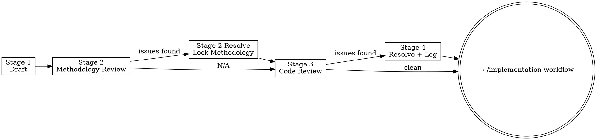

# Surveyverse Spec Workflow

**Announce at start:** "Running spec-workflow Stage N — [stage name]."

Five stages, always in order. Stages 2 and 2 Resolve are conditional — skip
them if the spec contains no variance estimation, estimators, or statistical
inference:

1. **Stage 1 — Draft:** Write the spec
2. **Stage 2 — Methodology review:** Single exhaustive statistical pass *(conditional)*
3. **Stage 2 Resolve — Lock methodology:** Resolve all methodology issues; spec is methodology-locked after this
4. **Stage 3 — Code review:** Adversarial architecture/API pass *(may run multiple times)*
5. **Stage 4 — Resolve:** Interactively work through code review issues; log decisions

After the spec is approved, move to `/implementation-workflow`.



<HARD-GATE>
Do not hand off to `/implementation-workflow` until Stage 4 is complete, all
issues are resolved, and `plans/decisions-{id}.md` is populated. The spec must
be methodology-locked and code-quality-reviewed before any R code is written.
</HARD-GATE>

---

## Stage Routing

Determine which stage the user wants from context. If unclear, use
`AskUserQuestion`:

```
question: "Which stage of the spec workflow do you want to run?"
header: "Stage"
multiSelect: false
options:
  - label: "Stage 1 — Draft the spec"
    description: "Write a new spec from scratch."
  - label: "Stage 2 — Methodology review"
    description: "Statistical correctness pass (conditional: only for specs with variance estimation or inference). Single exhaustive pass — finds all issues before concluding."
  - label: "Stage 2 Resolve — Resolve methodology issues"
    description: "Work through the methodology review file. Methodology-locks the spec after completion."
  - label: "Stage 3 — Code/architecture review"
    description: "Adversarial API, contract, and test-plan pass. Can run multiple times."
  - label: "Stage 4 — Resolve code issues + log decisions"
    description: "Interactively work through the code review file issue by issue."
```

Then read the corresponding reference file before doing anything else:

| Stage | Reference file |
|---|---|
| 1 | `.claude/skills/spec-workflow/references/stage-1-draft.md` |
| 2 | `.claude/skills/spec-workflow/references/stage-2-methods-review.md` |
| 2 Resolve | `.claude/skills/spec-workflow/references/stage-2-methods-resolve.md` |
| 3 | `.claude/skills/spec-workflow/references/stage-3-review.md` |
| 4 | `.claude/skills/spec-workflow/references/stage-4-resolve.md` |

## Common Shortcuts to Resist

| Rationalization | Why it fails |
|---|---|
| "This feature has no math — Stage 2 is N/A" | Stage 2 self-assesses; don't skip it yourself. Read the reference and let it decide. |
| "The spec is clear enough, Stage 3 would just nitpick" | Stage 3 catches API coherence gaps and underspecified edge cases — not nitpicks. |
| "We can resolve that ambiguity in implementation" | Ambiguity discovered in implementation is a spec bug. Resolve it here. |
| "All issues are minor, I'll log decisions later" | `plans/decisions-{id}.md` must be populated before handing off. Log them now. |

---

## Rules in Context

Every stage works alongside — never instead of — these rule files:

| Rule file | What it governs |
|---|---|
| `code-style.md` | Indentation, pipe, air formatter, S7 patterns, cli error structure, argument order, helper placement |
| `r-package-conventions.md` | `::` usage, NAMESPACE, roxygen2, `@return`, `@examples`, export policy |
| `surveycore-conventions.md` | Naming patterns (`get_*`, `extract_*`, `set_*`), `@family`, return visibility, haven handling |
| `testing-standards.md` | `test_that()` scope, 98% coverage, assertion patterns, data generators |
| `testing-surveycore.md` | `test_invariants()`, layer 1 vs layer 3 error testing, `make_survey_data()`, numerical tolerances |

When a spec decision touches one of these rules, cite the rule file. When the
spec is silent on something these rules already define, note that the rule is
authoritative — the spec doesn't need to repeat it.

---

## File Locations

The `{id}` matches the feature branch identifier (e.g., `phase-2`, `survey-srs`).

```
Spec:                    plans/spec-{id}.md
Methodology review:      plans/spec-methods-review-{id}.md
Code review:             plans/spec-review-{id}.md
Decisions log:           plans/decisions-{id}.md
```

**Determining `{id}`:** Infer from user context first (e.g., "phase 2 spec" → `phase-2`,
"survey-srs spec" → `survey-srs`). If the spec file already exists, derive `{id}` from
its filename. If ambiguous, ask the user before reading or writing any file.
