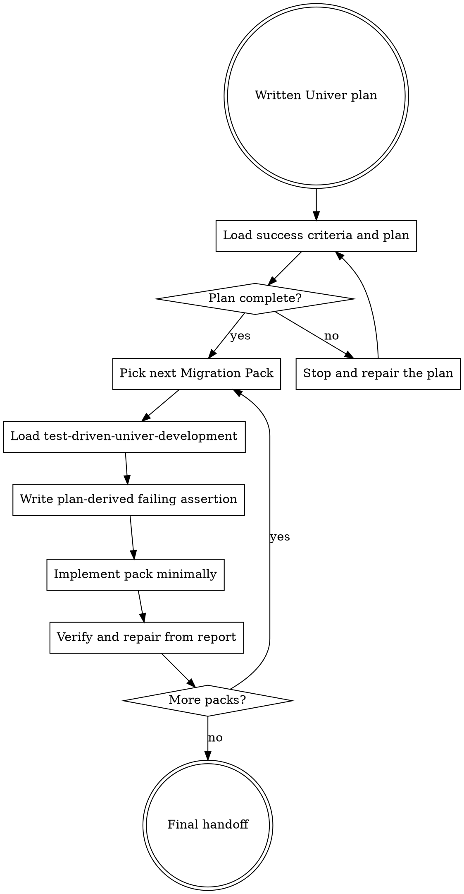

# Executing Univer Plans

Execute a written Univer workbook plan pack-by-pack. This skill turns the plan into SaC source work
without losing the workbook-domain contract.

Announce at start: "I'm using the executing-univer-plans skill to execute this Univer plan."

<EXTREMELY-IMPORTANT>
Do not execute a complex SaC workbook task without a plan written by `writing-univer-plans`.

IF THE PLAN IS INCOMPLETE, STOP AND REPAIR THE PLAN BEFORE WRITING ASSERTIONS OR MIGRATION PACKS.
</EXTREMELY-IMPORTANT>

## The Rule

Review the workbook success criteria and plan before touching execution files, then use test-driven
Univer development for each pack.

## The Process

### Step 1: Load Success Criteria and Review Plan

1. Read the success criteria file referenced by the plan.
2. Read the plan file.
3. Review it critically against the success criteria, workbook contract, range roles, decision evidence, pack sequence,
   assertion gates, and verify command.
4. If there are concerns, stop and repair the success criteria or plan before starting execution.
5. If there are no concerns, Create or update a task list with one task per Migration Pack.

### Step 2: Execute Tasks

For each pack task:

1. Mark the pack task as `in_progress`.
2. Follow each checkbox step exactly from the plan.
3. Load `test-driven-univer-development` when the plan reaches assertion or migration
   work.
4. Run the verifications specified by the plan and TDD skill.
5. Mark the pack task as `completed` only after meaningful passed assertion evidence exists.

### Step 3: Complete Development

After all pack tasks are complete, use `superpowers:verification-before-completion` or the local
repository completion gate before claiming done. For Univer SaC work, completion still needs the
final `univer sac verify <package.univer> --json` status and `verify-report.json` evidence.

## Load Success Criteria and Review the Plan

Before editing `assertions.ts` or `migrations/`, read the success criteria and plan critically.

Confirm it includes:

- a referenced `success-criteria/<topic>.md` file with a checklist, explicit non-goals, and plan-time ambiguities
- workbook-visible goal and explicit non-goals
- baseline evidence and readonly probes already used
- range roles with read/write/preserve rules
- workbook behavior contract fields relevant to the task
- Contract Decision Evidence for high-risk decisions
- Migration Pack sequence
- assertion gate for every non-trivial changed pack
- completion verify command

If any item is missing, Stop and repair the plan. Do not proceed from memory.

## Stop and Repair the Plan

Repair the plan before execution when:

- the plan does not reference success criteria
- a success checklist item is missing from the plan or contradicted by it
- a range role is unclear
- a high-risk decision lacks evidence strength
- an assumption is implicit or presented as proof
- a pack has no durable workbook intent
- a pack has no assertion gate
- the verify command is missing
- the plan conflicts with observed workbook evidence

Plan repair may require readonly `univer` probes. Capture useful findings back into the plan before
continuing. If the target outcome changed, update the success criteria before repairing plan details.

## Execute one Migration Pack at a time

For each pack:

1. Mark the pack as the current execution unit.
2. Mark the pack task as `in_progress`.
3. Follow each checkbox step exactly from the plan.
4. Load `test-driven-univer-development`.
5. Write or update the plan-derived assertion gate first.
6. For an already-applied pack, run `univer sac verify <package.univer> --json` and confirm the assertion
   fails for the intended workbook-visible reason. For a brand-new pending pack, do not use an
   empty/no-op pack to manufacture RED; instead confirm the missing behavior from baseline evidence,
   then write a minimal real migration source file.
7. Implement the minimal Migration Pack change that should satisfy the assertion.
8. Run apply/verify as required by the TDD skill.
9. Read `internal/sac/runs/<run-id>/verify-report.json` and repair from evidence.
10. Update the plan if execution reveals a behavior contract change.
11. Mark the pack task as `completed`.
12. Move to the next pack only after the current pack has meaningful passed assertion evidence.

Do not edit Migration Packs while the plan has missing assertion gates.
Do not batch multiple packs into one unchecked implementation step.

## Review Gates

After each pack, check:

- Did the assertion fail before implementation for the right reason?
- Does the passed assertion prove workbook-visible behavior, not only command success?
- Are preservation and negative constraints covered?
- Did execution discover a plan change that must be recorded?
- Did any pack get skipped, or does any changed pack still have zero assertions?
- Did any RED/GREEN evidence rely on `SAC_EMPTY_MIGRATION_PACK`, `SAC_PACK_FILE_INVALID`,
  `checkedPacks: 0`, or an all-skipped verify run? If yes, it is not meaningful evidence.

## When to Stop and Ask for Help

STOP executing immediately when:

- hit a blocker such as a missing workbook artifact, dependency, or command
- plan instructions are unclear or contradictory
- verification fails repeatedly
- underdetermined assumptions affect user-visible workbook behavior
- the plan and workbook evidence disagree
- the verify report does not identify a clear source/assertion split
- a non-Univer spreadsheet-library fallback appears necessary

Ask for clarification rather than guessing when the decision affects workbook-visible behavior.

## When to Revisit Earlier Steps

Return to Load and Review Plan when:

- the user updates scope, requirements, or workbook artifacts
- execution reveals a missing range role, decision, or assertion gate
- verify evidence changes the expected behavior
- the plan needs a different pack sequence or split

Do not force through blockers. Repair the plan first, then continue pack execution.

## Remember

- Review the plan critically first.
- Follow each checkbox step exactly.
- Do not skip verification commands.
- Reference `test-driven-univer-development` when a step writes assertions or migration source.
- Stop when blocked; do not guess workbook semantics.
- Never treat `univer sac apply` as completion evidence.

## Integration

Required workflow skills:

- `writing-univer-plans`: creates the workbook-domain plan this skill executes.
- `test-driven-univer-development`: implements each pack assertion-first.
- `superpowers:verification-before-completion`: verifies the final state before claiming completion.

## Red Flags

These thoughts mean STOP:

| Thought | Reality |
| --- | --- |
| "The plan is mostly complete; I can fill gaps while coding." | Execution depends on a complete workbook contract. |
| "I'll implement the pack, then write assertions." | Each pack needs a plan-derived failing assertion first. |
| "Several packs are related, so I'll implement them together." | Pack-level evidence disappears when execution is batched. |
| "The verify command passed once, so all packs are done." | Changed packs need meaningful assertion evidence. |
| "I can fix a failed assertion by matching the migration output." | Decide whether the source or assertion is wrong from workbook evidence. |

## Final Handoff

When an external harness supplies a delivery or stop gate, follow that harness after the required
handoff artifact is created. Do not keep collecting auxiliary evidence after handoff.

The handoff must include:

- plan path
- success criteria path
- executed Migration Pack sequence
- verification command
- final status
- `verify-report.json` path
- assertion evidence for each changed pack
- skipped packs, if relevant
- assumptions that remain underdetermined
