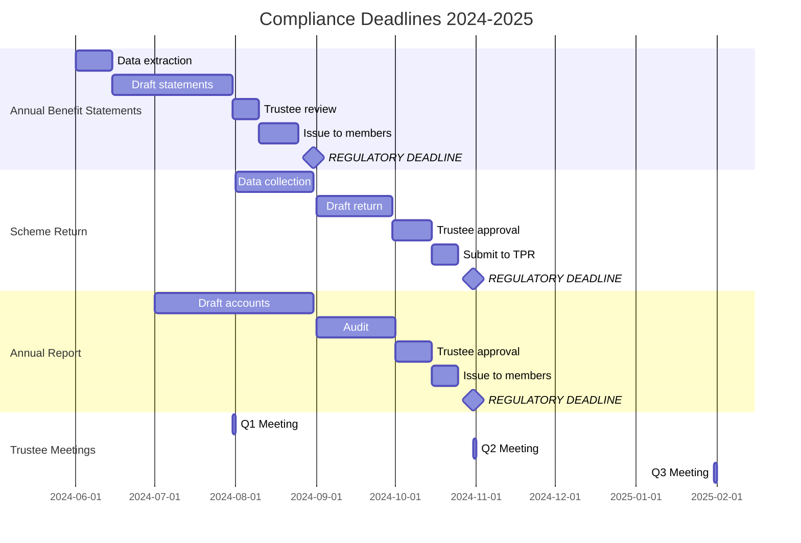

---
name: regulatory-deadline-tracker
description: Extract compliance deadlines from regulations, track trustee obligations, generate timeline, alert on upcoming deadlines, coordinate with Archon task management. Use when tracking regulatory deadlines, TPR requirements, compliance obligations, reporting schedules. Keywords: deadline, compliance, obligation, reporting, TPR, regulatory, schedule, timeline, alert.
allowed-tools: Bash, Read, Write, Grep, mcp__neo4j-apex__*, mcp__archon__find_tasks, mcp__archon__manage_task, mcp__archon__find_projects
model: claude-sonnet-4-5
---

# Regulatory Deadline Tracker

## Purpose

Track regulatory compliance deadlines, trustee obligations, reporting requirements, and coordinate with Archon task management to ensure nothing is missed. Specializes in UK pensions regulatory requirements.

## When to Use

- Starting new compliance cycle
- After regulatory changes/amendments
- Monthly/quarterly deadline reviews
- Setting up new pension scheme tracking
- Coordinating trustee meeting schedules
- Managing TPR reporting requirements

## Deadline Sources

### Neo4j Apex Database
Regulatory obligations with:
- Requirement descriptions
- Deadline types (annual, quarterly, event-driven)
- Penalty information
- Source regulations

### Common Deadlines

**Annual**:
- Annual Benefit Statements: 5 months after scheme year end
- Scheme Return: 7 months after scheme year end
- Annual Report & Accounts: 7 months after scheme year end
- Actuarial Valuation: Every 3 years
- Investment Strategy Statement Review: Annually
- Risk Register Review: Annually

**Quarterly**:
- Trustee meetings (typically quarterly)
- Investment performance review
- Cash flow monitoring

**Event-Driven**:
- Material changes notification: 30 days
- Reportable breaches: "As soon as reasonably practicable"
- Scheme amendments: Submit to TPR
- Member notifications: Within reasonable time

## Deadline Tracking Workflow

### Phase 1: Initialize Tracking

**Step 1: Identify scheme and year**

```
Scheme: [Scheme name]
Scheme Year End: [Date, typically 31 March]
Tracking Period: [YYYY-MM-DD] to [YYYY-MM-DD]
```

**Step 2: Query regulatory obligations**

```
# Get all obligations from Apex database
mcp__neo4j-apex__read_neo4j_cypher(
  query="
    MATCH (o:Obligation)
    WHERE o.applies_to = 'pension scheme' OR o.applies_to = 'trustees'
    RETURN o.title, o.description, o.deadline_type, o.deadline_calculation,
           o.penalty, o.source_regulation
    ORDER BY o.priority DESC
  "
)
```

**Step 3: Check existing Archon tasks**

```
# Find pension project in Archon
mcp__archon__find_projects(query="[scheme name]")

# Get existing compliance tasks
mcp__archon__find_tasks(
  project_id="[project-id]",
  query="deadline OR compliance OR reporting",
  filter_by="status",
  filter_value="todo"
)
```

### Phase 2: Calculate Deadlines

**Annual deadlines based on scheme year end**:

```python
# Example: Scheme year end 31 March 2024

scheme_year_end = "2024-03-31"

# Annual Benefit Statements: 5 months after year end
abs_deadline = "2024-08-31"

# Scheme Return: 7 months after year end
scheme_return_deadline = "2024-10-31"

# Annual Report: 7 months after year end
annual_report_deadline = "2024-10-31"
```

**Lead time for preparation**:

```markdown
## Timeline with Lead Times

### Annual Benefit Statements
- **Deadline**: 31 August 2024
- **Start prep**: 1 June 2024 (3 months before)
- **Data extract**: 15 June 2024
- **Draft review**: 31 July 2024
- **Issue to members**: 25 August 2024 (buffer)

### Scheme Return
- **Deadline**: 31 October 2024
- **Start prep**: 1 August 2024 (3 months before)
- **Data collection**: 31 August 2024
- **Draft to trustees**: 30 September 2024
- **Submit to TPR**: 25 October 2024 (buffer)

### Annual Report & Accounts
- **Deadline**: 31 October 2024
- **Start prep**: 1 July 2024 (4 months before)
- **Draft accounts**: 31 August 2024
- **Audit**: September 2024
- **Trustee approval**: 15 October 2024
- **Issue to members**: 25 October 2024 (buffer)
```

### Phase 3: Create Archon Tasks

**For each major deadline, create task chain**:

```
# Example: Annual Benefit Statements

# Task 1: Data preparation
mcp__archon__manage_task(
  action="create",
  project_id="[project-id]",
  title="ABS: Extract member data",
  description="Extract member data for Annual Benefit Statements. Include all active, deferred, and pensioner members as at 31 March 2024.

Data required:
- Member details (name, address, NI number)
- Service history
- Contributions paid
- Benefit entitlements
- Transfer values (if applicable)

Deadline: 15 June 2024",
  status="todo",
  assignee="[Administrator]",
  task_order=90,
  feature="Annual Benefit Statements 2024"
)

# Task 2: Draft statements
mcp__archon__manage_task(
  action="create",
  project_id="[project-id]",
  title="ABS: Draft statements for review",
  description="Prepare draft Annual Benefit Statements using extracted data. Review sample statements for accuracy.

Checks:
- Calculation accuracy
- Template updated with current rates
- Explanatory text clear
- Contact details correct

Deadline: 31 July 2024",
  status="todo",
  assignee="[Administrator]",
  task_order=85,
  feature="Annual Benefit Statements 2024"
)

# Task 3: Trustee review
mcp__archon__manage_task(
  action="create",
  project_id="[project-id]",
  title="ABS: Trustee review and approval",
  description="Present sample Annual Benefit Statements to trustees for review and approval.

Review points:
- Content accuracy
- Clarity of explanations
- Compliance with regulations

Deadline: 10 August 2024",
  status="todo",
  assignee="[Trustees]",
  task_order=80,
  feature="Annual Benefit Statements 2024"
)

# Task 4: Issue to members
mcp__archon__manage_task(
  action="create",
  project_id="[project-id]",
  title="ABS: Issue statements to members",
  description="Issue approved Annual Benefit Statements to all members.

Issue method:
- Email (if consent given)
- Post (all others)
- Member portal (if available)

DEADLINE: 31 August 2024 (regulatory)
Issue by: 25 August 2024 (5-day buffer)

Deadline: 25 August 2024",
  status="todo",
  assignee="[Administrator]",
  task_order=75,
  feature="Annual Benefit Statements 2024"
)
```

### Phase 4: Generate Calendar/Timeline

**Create visual timeline**:

```markdown
## Compliance Calendar 2024-2025

### June 2024
- 01 Jun: Start ABS preparation
- 15 Jun: ABS data extract deadline

### July 2024
- 01 Jul: Start Annual Report prep
- 31 Jul: ABS draft review deadline
- 31 Jul: Q1 trustee meeting

### August 2024
- 01 Aug: Start Scheme Return prep
- 10 Aug: ABS trustee approval
- 25 Aug: Issue ABS to members
- 31 Aug: **ABS REGULATORY DEADLINE**
- 31 Aug: Annual Report draft accounts

### September 2024
- Throughout: Annual Report audit
- 30 Sep: Scheme Return draft to trustees

### October 2024
- 15 Oct: Annual Report trustee approval
- 25 Oct: Submit Scheme Return (buffer)
- 25 Oct: Issue Annual Report (buffer)
- 31 Oct: **SCHEME RETURN DEADLINE**
- 31 Oct: **ANNUAL REPORT DEADLINE**
- 31 Oct: Q2 trustee meeting

### November 2024
- Review compliance for H1

### December 2024
- Plan next year's schedule

### January 2025
- 31 Jan: Q3 trustee meeting
- Start planning for 31 March 2025 year end

### March 2025
- 31 Mar: Scheme year end 2024/25
- Start next cycle
```

**Mermaid Gantt chart**:



### Phase 5: Alert System

**Alert thresholds**:

```markdown
## Alert Configuration

### Critical Alerts (Red 🔴)
- **7 days before deadline**: Final warning
- **Missed deadline**: Immediate escalation

### Warning Alerts (Amber 🟡)
- **30 days before deadline**: Start preparation alert
- **14 days before deadline**: Urgency warning

### Information Alerts (Green 🟢)
- **60 days before deadline**: Advance notice
- **Task completed**: Confirmation
```

**Alert format**:

```markdown
🔴 **CRITICAL: Deadline in 7 Days**

**Obligation**: Annual Benefit Statements
**Deadline**: 31 August 2024
**Days Remaining**: 7
**Status**: ⚠️ Draft statements not yet approved

**Required Actions**:
1. Trustee approval URGENT
2. Printing/mailing arrangements
3. Email distribution setup

**Consequences of Missing**:
- Regulatory breach reportable to TPR
- Potential fine
- Member complaints

**Owner**: [Administrator name]
**Escalate to**: [Trustee chair]

**Related Archon Tasks**:
- Task #123: "ABS: Trustee review" (Status: doing)
- Task #124: "ABS: Issue to members" (Status: todo)
```

### Phase 6: Progress Tracking

**Weekly status report**:

```markdown
## Compliance Status Report
**Week Ending**: [Date]
**Reporting Period**: [Start] to [End]

### Upcoming Deadlines (Next 30 Days)

| Deadline | Date | Days Left | Status | Owner | RAG |
|----------|------|-----------|--------|-------|-----|
| Annual Benefit Statements | 31 Aug | 28 | On track | Admin | 🟢 |
| Trustee Meeting Q2 | 31 Oct | 52 | Scheduled | Secretary | 🟢 |

### Overdue Items

| Deadline | Date | Days Overdue | Status | Owner | Action Required |
|----------|------|--------------|--------|-------|-----------------|
| [None] | - | - | - | - | - |

### Recently Completed

| Obligation | Completion Date | Notes |
|------------|-----------------|-------|
| Q1 Trustee Meeting | 31 Jul | All agenda items completed |

### At Risk

| Deadline | Risk | Mitigation |
|----------|------|------------|
| [None currently at risk] | - | - |

### Actions Required This Week

1. [Action 1] - [Owner] - [Due date]
2. [Action 2] - [Owner] - [Due date]

### Notes

[Any relevant notes or context]
```

## Event-Driven Deadline Handling

**Trigger-based deadlines**:

### Material Changes
```
**Event**: Material change to scheme
**Trigger**: Decision made / change implemented
**Deadline**: 30 days from trigger
**Action**: Notify TPR

**Process**:
1. Identify change is "material" (check definition)
2. Create Archon task immediately
3. Prepare notification
4. Submit to TPR within 30 days
```

### Reportable Breaches
```
**Event**: Breach of pension law identified
**Trigger**: Breach identified
**Deadline**: As soon as reasonably practicable
**Action**: Report to TPR (if material significance)

**Process**:
1. Assess materiality (legal advice if uncertain)
2. If reportable, create Archon task
3. Prepare breach report
4. Submit to TPR ASAP
5. Implement remediation
```

### Member Notifications
```
**Event**: Change affecting member benefits
**Trigger**: Scheme amendment approved
**Deadline**: Within reasonable time (typically 30-90 days)
**Action**: Notify affected members

**Process**:
1. Identify affected members
2. Draft notification
3. Trustee approval
4. Issue within deadline
```

## Deadline Management Best Practices

### 1. Build in Buffer Time
```
❌ Bad: Target the regulatory deadline
✓ Good: Target 5-7 days before regulatory deadline

Example:
Regulatory deadline: 31 August
Internal deadline: 25 August
Buffer: 6 days for delays/issues
```

### 2. Break Down Large Deliverables
```
Don't create one task "Prepare Annual Benefit Statements"

Do create task chain:
1. Extract data
2. Review data quality
3. Generate statements
4. Sample checking
5. Trustee review
6. Corrections
7. Final approval
8. Printing/distribution
```

### 3. Assign Clear Ownership
```
❌ Bad: "Team to complete"
✓ Good: Specific person assigned with backup identified

Owner: [Name]
Backup: [Name]
Escalation: [Name]
```

### 4. Link to Source Regulations
```
Every deadline should reference:
- Source regulation
- Specific clause
- Interpretation guidance
- Penalty for non-compliance
```

### 5. Review Regularly
```
Weekly: Review deadlines for next 30 days
Monthly: Review full quarterly pipeline
Quarterly: Review annual calendar
Annually: Update for regulatory changes
```

## Integration with Archon

**Sync workflow**:

```bash
# Daily sync check
# Run this script daily to check upcoming deadlines

#!/bin/bash
# Check deadlines in next 7 days
# Create/update Archon tasks if needed
# Send alerts if critical deadlines approaching

# Example:
# 1. Query Apex for deadlines
# 2. Check Archon for corresponding tasks
# 3. Create tasks if missing
# 4. Update task priorities based on days remaining
# 5. Send alerts via email/Teams
```

## Integration with Other Skills

- **lgps-scheme-amendment-analyzer**: Creates deadline tasks for amendments
- **pension-calculation-validator**: Ensures ABS calculations complete on time
- **cost-report-generator**: Include compliance cost tracking
- **github-workflow**: Version control deadline templates/schedules

## Quick Commands

```bash
# Find upcoming deadlines in documents
grep -iE "deadline|due date|by [0-9]{1,2} [A-Z][a-z]+|within [0-9]+ days" *.txt

# Extract dates
grep -Eo "[0-9]{1,2}[/ -](January|February|March|April|May|June|July|August|September|October|November|December|Jan|Feb|Mar|Apr|May|Jun|Jul|Aug|Sep|Oct|Nov|Dec)[/ -][0-9]{2,4}" *.txt

# Search regulations for deadline keywords
grep -i "shall.*within\|must.*by\|deadline\|time limit" regulations.txt
```

## Summary

This skill provides comprehensive regulatory deadline tracking by:
- Extracting obligations from Neo4j Apex database
- Calculating deadlines based on scheme year end
- Creating task chains in Archon for complex deliverables
- Generating visual timelines and calendars
- Providing alert system at 60/30/14/7 day thresholds
- Tracking progress with weekly status reports
- Handling event-driven deadlines
- Integrating with Archon task management

**Use Sonnet model** - deadline tracking doesn't require Opus complexity.

Ensures nothing falls through the cracks and compliance obligations are met consistently.
