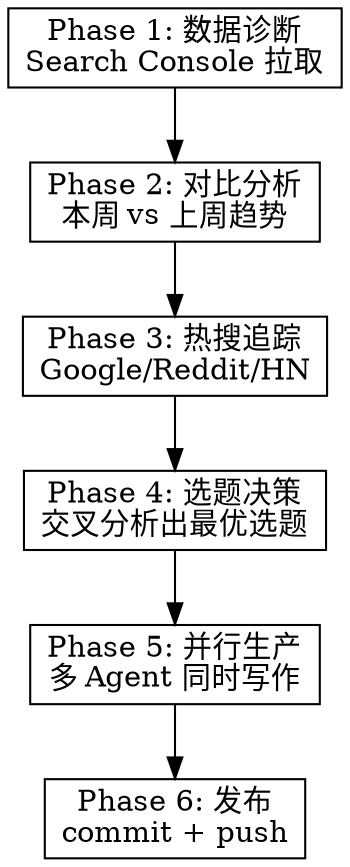

# Daily Blog Growth Engine

## Overview

数据驱动的每日博客增长工作流。通过 Google Search Console 诊断 + 热搜追踪 + 内容矩阵策略，自动生成最优选题并并行产出文章。

**核心原则**：不靠猜，靠数据。每篇文章都有 Search Console 数据或热搜趋势支撑。

## When to Use

- 用户说"今天写什么文章"、"博客诊断"、"运营博客"
- 每日定期博客运营
- 需要数据驱动的选题建议
- 需要批量产出 + SEO 优化

**When NOT to use**: 用户已有明确选题只需写作时，用 `blog-writer` skill。

## Workflow



---

## Phase 1: 数据诊断 (Search Console)

通过 RUBE_SEARCH_TOOLS 连接 Google Search Console，拉取 3 组数据：

### 1.1 必拉数据（并行请求）

| 查询 | 维度 | 时间范围 | 用途 |
|------|------|---------|------|
| 搜索词表现 | `dimensions: ["query"]` | 最近 30 天 | 找高展示低点击的关键词机会 |
| 页面表现 | `dimensions: ["page"]` | 最近 30 天 | 找表现最好/最差的页面 |
| 每日趋势 | `dimensions: ["date"]` | 最近 30 天 | 看流量走势 |

### 1.2 连接配置

```
site_url: "sc-domain:heyuan110.com"
data_state: "final"
row_limit: 25000 (query), 5000 (page), 50 (date)
```

### 1.3 关键指标提取

从返回数据中提取：
- **Top 10 页面**（按 clicks 排序）
- **潜力股页面**（impressions > 100 但 CTR < 2% 或 position > 15）
- **高频搜索词**（impressions > 10 但 clicks = 0）
- **日均点击趋势**（是在涨还是在跌）

---

## Phase 2: 对比分析（周环比）

### 2.1 拉取上周数据

额外请求上一个 30 天周期的数据（即 60-30 天前），按 page 维度：

```
start_date: 60天前
end_date: 30天前
dimensions: ["page"]
```

### 2.2 对比维度

| 指标 | 计算方式 | 意义 |
|------|---------|------|
| 点击变化 | 本周 clicks - 上周 clicks | 哪些页面在涨/跌 |
| 展示变化 | 本周 impressions - 上周 impressions | 搜索需求趋势 |
| 排名变化 | 上周 position - 本周 position | 正数=排名上升 |
| 新增页面 | 本周有、上周无的页面 | 新文章表现 |

### 2.3 输出格式

```markdown
## 周环比分析

### 上升最快的页面
| 页面 | 本周点击 | 上周点击 | 变化 |
| ... | ... | ... | +XX |

### 下降最多的页面
| 页面 | 本周点击 | 上周点击 | 变化 |
| ... | ... | ... | -XX |

### 新文章表现
| 页面 | 发布天数 | 点击 | 展示 | 评价 |
```

---

## Phase 3: 热搜追踪

### 3.1 搜索来源（按优先级）

用 WebSearch 搜索以下来源的热门话题：

1. **与博客定位相关的热搜**：
   - `"Claude Code" OR "AI coding" 2026 site:reddit.com`
   - `"AI agent" OR "MCP" trending 2026 site:news.ycombinator.com`
   - `"AI 编程" OR "Claude" 最新 2026`

2. **Google Trends 相关话题**：
   - 搜索当前 AI/编程领域的热门上升趋势

3. **竞品博客动态**：
   - 搜索竞品博客最新发布的热门文章

### 3.2 热搜评估标准

| 标准 | 权重 | 说明 |
|------|------|------|
| 与博客定位匹配度 | 高 | 必须是 AI/编程/工具相关 |
| 搜索量潜力 | 高 | 有明确搜索需求 |
| 竞争程度 | 中 | 避开大站已占据的词 |
| 时效性 | 中 | 越新越好，能抢先发 |
| 与现有内容关联度 | 低 | 能形成内链更好 |

---

## Phase 4: 选题决策

### 4.1 交叉分析

将 Phase 1-3 的数据交叉分析，生成选题建议：

**选题来源优先级**：

1. **数据缺口型**（最高 ROI）：高展示 + 低点击的搜索词 → 写精准匹配文章
2. **趋势追热型**：热搜话题 + 博客有相关基础 → 快速产出蹭热度
3. **系列深耕型**：已有高流量主题 → 继续产出系列文章建立权威
4. **翻新优化型**：高展示但排名靠后的老文章 → SEO 优化

### 4.2 选题输出格式

向用户展示 3-5 个选题建议，每个包含：

```markdown
### 建议 1: [文章标题]
- **来源**: 数据缺口 / 热搜追踪 / 系列深耕
- **目标关键词**: xxx（月展示 XX 次）
- **预期效果**: 从现有 XX 展示中多获取 XX 点击
- **难度**: 低/中/高
- **类型**: 新文章 / 老文章优化
```

### 4.3 默认执行策略

如果用户说"都干"或不做选择，默认执行：
- 1 篇数据缺口型新文章
- 1 篇趋势追热型新文章
- 2-3 篇老文章 SEO 优化

---

## Phase 5: 并行生产

### 5.1 Agent 分派

使用 Task tool 并行启动多个 agent：

```
Agent 1: 新文章写作（参考 blog-writer skill 的写作规范）
Agent 2: 新文章写作（同上）
Agent 3: 老文章 SEO 优化（批量处理 2-3 篇）
```

### 5.2 新文章 Agent 指令模板

每个写作 agent 必须包含以下上下文：

- 目标关键词和搜索数据
- 博客 Front Matter 格式（TOML `+++`）
- 文章目录路径 `content/posts/ai/YYYY-MM-DD-slug/index.md`
- 分类规则（AI实战 or AI原理）
- 中文写作要求
- blog-writer skill 中的写作规范和 SEO 规范

### 5.3 老文章优化 Agent 指令要点

- 读取原文，不丢失已有内容
- 优化 title（关键词前置，50-60 字符）
- 优化/添加 description（120-160 字符）
- 扩充 keywords 数组
- 开头段落加入核心关键词
- 补充实用内容（FAQ、速查表、对比表）
- 添加内链到相关文章
- 不修改原始 date 字段

---

## Phase 6: 发布

### 6.1 发布流程

```bash
# 1. 检查所有变更
git status
git diff --stat

# 2. Stage 所有变更文件（逐个添加，不用 git add -A）
git add content/posts/ai/新文章1/index.md
git add content/posts/ai/新文章2/index.md
git add content/posts/xxx/优化的老文章.md
# ...

# 3. Commit（中文 message）
git commit -m "新增N篇文章 + 优化N篇老文章SEO

新文章：
- 文章1标题
- 文章2标题

SEO优化：
- 优化文章1
- 优化文章2

Co-Authored-By: Claude Opus 4.6 <noreply@anthropic.com>"

# 4. Push 到 code 分支（自动触发部署）
git push origin code
```

### 6.2 发布确认

发布后向用户展示：
- 变更文件数和总行数
- 新文章列表（含标题和路径）
- 优化文章列表（含主要改动）
- 部署链接 https://www.heyuan110.com/

---

## Quick Reference

### 每日运营节奏

```
诊断(5min) → 对比(2min) → 热搜(3min) → 选题(展示给用户) → 生产(并行) → 发布(1min)
```

### Search Console 关键阈值

| 场景 | 阈值 | 动作 |
|------|------|------|
| 高展示低点击 | impressions > 100, CTR < 2% | 写精准匹配新文章 |
| 高展示低排名 | impressions > 200, position > 15 | 优化老文章 SEO |
| 排名上升中 | position 改善 > 3 位 | 继续深耕该主题 |
| 新文章冷启动 | 发布 > 7 天, impressions < 10 | 检查标题/关键词 |

### 内容矩阵策略

围绕高流量主题持续产出，形成搜索权威：
- **主题 A**（如 Claude Code）：基础指南 → 进阶技巧 → 专项教程 → 对比评测
- **主题 B**（如 AI Agent）：概念科普 → 工具评测 → 实战案例 → 趋势分析
- 每篇新文章都内链到同主题其他文章

---

## Common Mistakes

| 错误 | 正确做法 |
|------|---------|
| 只看点击数选题 | 要看展示量，高展示低点击才是最大机会 |
| 追热点但不匹配博客定位 | 热点必须与 AI/编程/工具相关 |
| 新文章不做内链 | 每篇新文章至少 3-5 个内链 |
| 优化老文章时重写全文 | 只做增量优化：标题、描述、FAQ、速查表 |
| 一次写太多低质量文章 | 2 篇高质量 + 2-3 篇优化 > 5 篇水文 |
| 忽略 Front Matter 格式 | 必须用 TOML（+++），含 title/description/keywords/tags |
